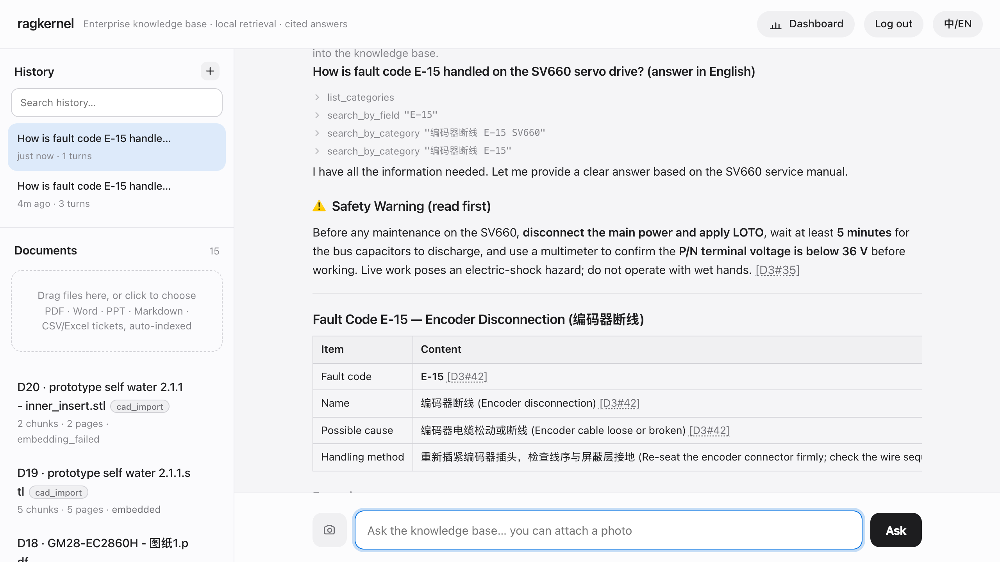

# RagKernel

### Verifiable engineering knowledge for humans and AI agents.

[](LICENSE) · [中文](README_zh.md) · [Documentation](docs/README.md)

`Technical documents` · `Engineering entities` · `Hybrid retrieval` · `Claim verification` · `MCP` · `Native STEP/STL`

> RagKernel is a verifiable engineering **knowledge engine** for building evidence-grounded systems over documents, CAD models, and equipment data. Additional engineering formats are planned behind the same ingestion contract.



<sub>Ask in natural language → RagKernel retrieves evidence first, then answers with a per-claim citation back to the source document and section. If it isn't in the corpus, it says so.</sub>

## Quick Start

The installer touches your database, API keys, and documents. **For security-sensitive environments, review the script before execution:**

```bash
curl -fsSL https://raw.githubusercontent.com/v0id-byte/ragkernel/main/install.sh -o install.sh
less install.sh
sh install.sh
```

Or pipe it directly:

```bash
curl -fsSL https://raw.githubusercontent.com/v0id-byte/ragkernel/main/install.sh | sh
```

It provisions the runtime (uv / Python 3.12 / dependencies), then walks you through LLM provider → local models → admin account → MCP integration. Run `ragkernel doctor` any time to self-check.

Prefer to do it by hand:

```bash
uv sync                       # add --extra cad for native STEP/STL
uv run ragkernel setup        # provider / admin / models / MCP token
uv run ragkernel models       # one-time local embedding + reranker download (~2GB)
uv run ragkernel serve        # open http://127.0.0.1:8360
```

Drop manuals, tickets, or CAD files into the web UI → they are indexed automatically → ask a question → get an answer with traceable citations.

Installer flags, Docker, and non-interactive/CI installs → [docs/installation.md](docs/installation.md).

## Why RagKernel

While developing embedded systems and designing PCBs, I repeatedly searched through hundreds of pages of datasheets and reference manuals. Existing RAG pipelines could retrieve relevant text, but they flattened engineering documents into chunks — losing engineering context and the link between an answer and its original evidence. RagKernel preserves engineering **structure, evidence, provenance, and geometry**, so humans and AI agents retrieve knowledge that is traceable and verifiable.

## Capabilities

- **Engineering document ingestion** — PDF (Docling + RapidOCR, real page numbers), DOCX / PPTX / HTML, Markdown / TXT, CSV / XLSX tickets.
- **Native CAD ingestion (STEP / STL)** — assembly trees, exact B-rep geometry, mesh validity; optional `[cad]` extra. See [docs/cad.md](docs/cad.md).
- **Element-aware chunking** — spec / fault-code / pinout tables split one row per chunk, procedures kept whole, engineering dimensions preserved, each chunk carrying structured metadata.
- **Hybrid retrieval** — BM25 + vector fused by RRF, reranked by a local cross-encoder, with exact metadata filtering (`search_by_field`).
- **Traceable citations** — every result carries stable document and chunk identifiers, plus source page numbers when the format and parser provide them.
- **Evidence-backed claim checking** — `verify_engineering_claim` returns *supported / contradicted / unsupported* with real page citations.
- **Explicit provenance** — CAD measurements distinguish `brep_computed`, `mesh_computed`, and `file_declared`; invalid meshes report an invalid state instead of a misleading volume.
- **MCP server** — read-only retrieval exposed to agents (stdio + HTTP, token auth, tiered rate limiting) alongside CLI and Web.
- **Operable by default** — one-line deployment, guided `ragkernel setup`, read-only `ragkernel doctor` with JSON output for monitoring.

Full capability matrix and supported formats → [docs/capabilities.md](docs/capabilities.md).

## Documentation

Full documentation lives in [`docs/`](docs/README.md).

| Doc | What's in it |
|---|---|
| [Installation](docs/installation.md) | installer flags, manual install, Docker, platform requirements |
| [Configuration](docs/configuration.md) | provider setup, config precedence, `ragkernel setup` |
| [Capabilities](docs/capabilities.md) | format matrix, retrieval, guarantees, current limits |
| [CLI reference](docs/cli.md) | all commands + verification and eval scripts |
| [Architecture](docs/architecture/overview.md) | engine layers, code map, document lifecycle |
| [Native CAD](docs/cad.md) | STEP/STL formats, exact vs approximate geometry, CAD tools |
| [Diagnostics](docs/diagnostics.md) | `ragkernel doctor` contract, exit codes, JSON schema |
| [Web UI](docs/web-ui.md) | ingestion, dashboard, admin console |
| [Design principles](docs/design-principles.md) | principles and philosophy |

## Scope & limits

RagKernel parses text, tables, pin definitions, dimension callouts, and scanned content in technical PDFs with real page citations, and reads verifiable STEP/STL geometry natively. It does **not** read DWG / SLDPRT / Parasolid natively, rebuild parametric feature trees, or perform full GD&T and hole recognition (a cylindrical face is not a confirmed hole). Page citations follow the parser's element provenance — rows of a table spanning multiple pages may currently cite the table's starting page. Single-tenant MVP; multi-tenancy and RBAC are future work.

## License

Licensed under the **Business Source License 1.1** — source-available.
Free for personal, educational, research, and internal business use; each released version converts to Apache 2.0 on **2029-07-21**.
See [LICENSE](LICENSE) for the full terms. Commercial hosted or managed services offered to third parties require a separate commercial license.

Created and maintained by v0id-byte. Copyright © 2026 Liuhaoran Qin.
