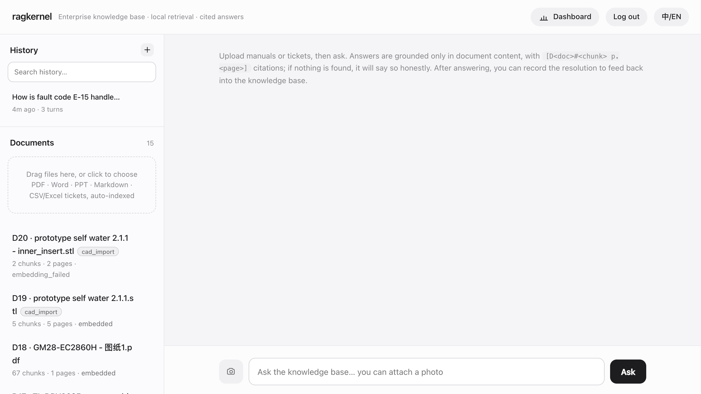
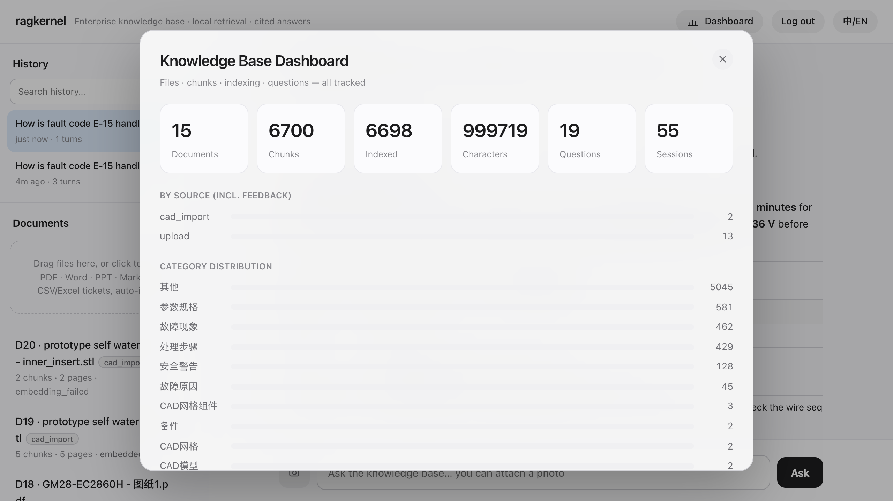
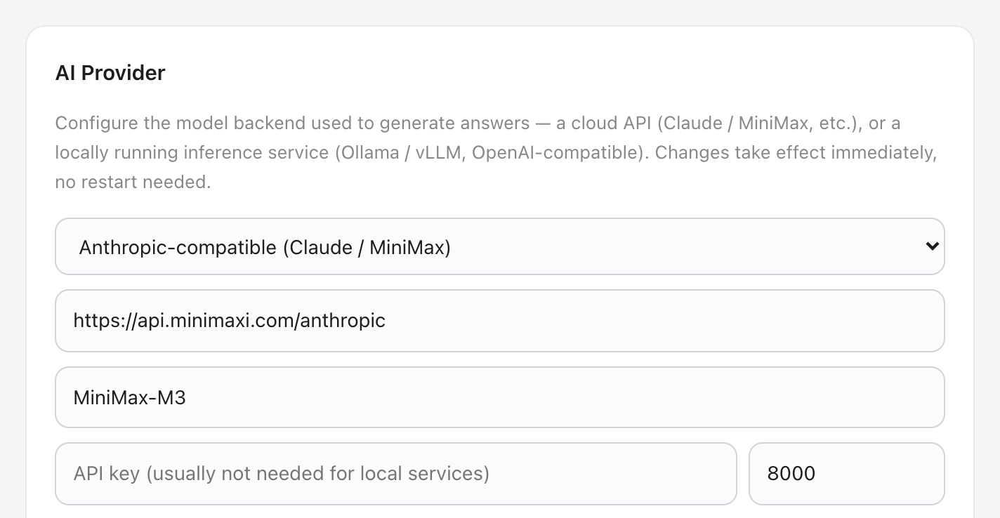

# Web 界面

> 摄取、知识运营仪表盘与管理控制台的实际界面。

[← Back to documentation](README.md)

拖手册、工单、CAD 进去 → 自动索引 → 提问 → 得到带引用（含分类、页码）的答案 → 「记录处理结果」回填。人（Web · CLI）与 AI Agent（MCP）用的是同一份知识。

## 文档摄取

把手册、工单或 CAD 文件拖进侧边栏 —— PDF、Word、PPT、Markdown、CSV/Excel 与原生 STEP/STL —— 自动切片、嵌入、索引，每份文档有独立状态。

## 知识运营

内置仪表盘一眼看清语料全貌：文档数、片段数、已索引向量、问题数、会话数，以及知识库的分类分布。

## 管理控制台

在管理台配置回答模型 —— 云 API（Claude / MiniMax）或本地 OpenAI 兼容服务（vLLM / Ollama）—— 以及用户与知识库管理。改完即时生效，无需重启。配置优先级见 [configuration.md](configuration.md)。

